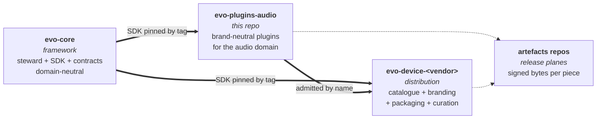
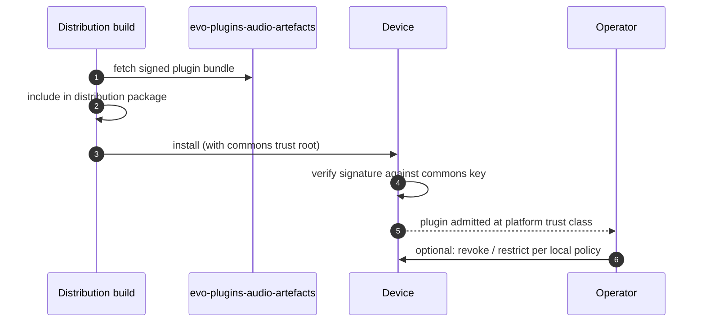

# evo-plugins-audio

> Brand-neutral audio-player plugins for the [evo](https://github.com/foonerd/evo-core) fabric. The middle tier between the framework and any audio-shaped distribution.

A distribution that builds an audio player on top of evo does not need to invent an MPD warden, a local-file metadata respondent, an ALSA delivery, or an ID3 tag reader. Those exist here, signed by the evo project, ready to be admitted into any catalogue that declares the audio domain.

## How it fits together

Three repository tiers, each with one job.

-   **Framework (`evo-core`)** ships the steward, SDK, and contracts. Domain-neutral. Pinned by tag.
-   **Plugin commons (this repo)** ships brand-neutral plugins for one domain. Pinned by tag. Signed under the evo project's commons key. Distributions admit commons plugins by name.
-   **Distribution (`evo-device-<vendor>`)** ships the catalogue, branding, frontend integration, packaging, and any plugins that are genuinely vendor-specific.

A second audio distribution stocks its catalogue from this commons unchanged. A non-audio distribution (signage, home automation, scientific instrument) follows the same pattern with its own `evo-plugins-<domain>` commons.

## What this repository contains

Plugins, and only plugins.

-   Brand-neutral plugin crates that wrap commodity audio infrastructure (MPD, ALSA, NetworkManager, Samba, ID3/FLAC/Vorbis tag readers, NAS mounts, file sharing, library scanning).
-   A workspace-internal shared crate (`crates/evo-plugins-audio-shared`) for utilities used across plugins (path normalisation, library scanning, common error types). Compiled into plugins; not shipped as a separate artefact.
-   The plugin commons signing key (public half).
-   Build, test, and signing pipelines that produce signed artefacts for the release plane.

It does **not** contain:

-   A catalogue. Catalogues are authored by distributions.
-   Branding. Logos, colour palettes, product names live with the distribution.
-   A frontend. Web UIs and HMIs live with the distribution.
-   Vocabulary as a separately-pinned contract. Subject types and relation predicates are declared in distribution catalogues; this commons publishes plugins that speak whatever vocabulary their slot contracts require.

## Plugin namespace

Plugins published from this repository live under the reverse-DNS namespace `org.evoframework.*`.

-   `org.evoframework.playback.mpd`
-   `org.evoframework.metadata.local`
-   `org.evoframework.artwork.local`
-   ...

The namespace is reserved for plugin commons artefacts signed by the evo project's commons key. Vendors do not publish under this namespace. Per-vendor namespaces (`com.volumio.*`, `com.acme.*`, etc.) remain the home for genuinely vendor-specific plugins.

## Trust posture

Every plugin published from this repository is signed by the evo project under a single commons signing key. The public half lives in [`keys/commons-plugin-signing-public.pem`](keys/commons-plugin-signing-public.pem) with sidecar metadata in [`keys/commons-plugin-signing-public.meta.toml`](keys/commons-plugin-signing-public.meta.toml).

Distributions bundle this public key in their trust material by default, alongside their own vendor key. An operator may override the trust posture per `VENDOR_CONTRACT.md`'s operator-sovereignty position - the operator decides what runs on their device.

The private signing key lives only in the GitHub Actions repository secret `PLUGIN_SIGNING_KEY_PEM`. It never leaves the runner.

## How a distribution consumes a commons plugin

A distribution catalogue admits the commons plugin by its `org.evoframework.*` name. The steward verifies the signature against the commons trust root and admits the plugin at the trust class declared in the manifest.

## Status

Early. Phase 1 scaffolding only. The first plugins migrate here from `evo-device-volumio` as Phase 2 work, renamed under `org.evoframework.*`:

-   `com.volumio.playback.mpd` -> `org.evoframework.playback.mpd`
-   `com.volumio.metadata.local` -> `org.evoframework.metadata.local`
-   `com.volumio.artwork.local` -> `org.evoframework.artwork.local`

`evo-core` is pinned at tag `v0.1.9` via `[workspace.dependencies]` in `Cargo.toml`. Bumps are deliberate; see [DEVELOPING.md](DEVELOPING.md) for the procedure.

## For other domains

`evo-plugins-video`, `evo-plugins-home`, `evo-plugins-instrument`, whichever commons comes next reads this repository as the worked example. The pattern is the same:

-   A source repo named `evo-plugins-<domain>` and an artefacts repo named `evo-plugins-<domain>-artefacts`.
-   The framework pinned by tag.
-   Every plugin signed with the evo project's commons key.
-   No catalogue, no branding, no vocabulary versioning - those stay at the distribution tier.

## Related

-   [foonerd/evo-core](https://github.com/foonerd/evo-core) - the framework.
-   [foonerd/evo-plugins-audio-artefacts](https://github.com/foonerd/evo-plugins-audio-artefacts) - the release plane for this commons.
-   [foonerd/evo-device-volumio](https://github.com/foonerd/evo-device-volumio) - the first audio distribution; consumes plugins from this commons.

## License

Apache 2.0. See [LICENSE](LICENSE).
